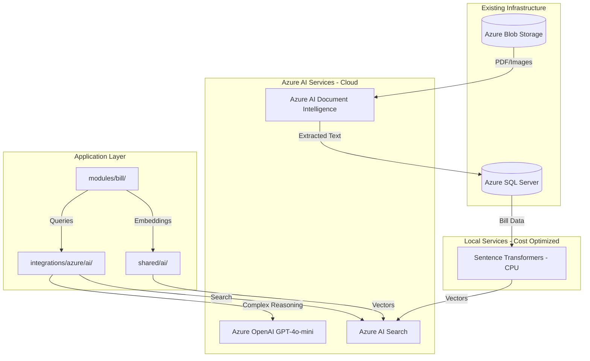

# AI Implementation Plan for Build.One

## Overview

Implement a cost-optimized AI layer using a hybrid approach - local embeddings for high-volume tasks, Azure OpenAI (GPT-4o-mini) for complex reasoning, and Azure AI Document Intelligence for document extraction. Starting with the Bill module.

## Phases

- [ ] **Phase 1**: Create shared/ai/ module with local embeddings, Azure OpenAI (GPT-4o-mini), Document Intelligence, and AI Search clients
- [ ] **Phase 2**: Implement document extraction using Azure AI Document Intelligence Layout model for any attachment type
- [ ] **Phase 3**: Set up Azure AI Search index with local embeddings for bills and documents
- [ ] **Phase 4**: Build natural language query interface using GPT-4o-mini to convert questions to structured queries
- [ ] **Phase 5**: Implement anomaly detection for duplicate bills and unusual patterns
- [ ] **Phase 6**: Add auto-categorization using local embeddings similarity for line items and vendors
- [ ] **Phase 7**: Build conversational AI copilot using GPT-4o-mini for bill-related questions and guided data entry

---

## Hybrid AI Architecture (Cost-Optimized)

Given cost priorities and medium volume (~hundreds of requests/day), a hybrid approach balances cost and quality:

| Capability | Deployment | Service/Model |
|------------|------------|---------------|
| Embeddings | Local (CPU) | Sentence Transformers (all-MiniLM-L6-v2) |
| Document Extraction | Azure Cloud | Azure AI Document Intelligence (Layout) |
| Semantic Search | Azure Cloud | Azure AI Search (vector search) |
| Natural Language Queries | Azure Cloud | Azure OpenAI (GPT-4o-mini) |
| Anomaly Detection | Hybrid | Rule-based + GPT-4o-mini for complex cases |
| Auto-Categorization | Local | Embedding similarity (no LLM needed) |
| AI Copilot | Azure Cloud | Azure OpenAI (GPT-4o-mini) |

**Cost Savings:**

- Local embeddings eliminate ~80% of token costs (embeddings are high-volume)
- GPT-4o-mini is 10-20x cheaper than GPT-4o with comparable quality for most tasks
- Categorization via embedding similarity requires no LLM calls

**Hardware: CPU Only (No GPU Required)**

- Local embeddings run efficiently on CPU using Sentence Transformers
- All complex reasoning handled by Azure OpenAI cloud services
- No local GPU infrastructure needed

## Architecture Overview



## Implementation Phases

### Phase 1: Core AI Infrastructure

Create AI modules split between Azure integrations and local services:

**Azure Services** (`integrations/azure/ai/`):

- `integrations/azure/ai/openai_client.py` - Azure OpenAI wrapper (GPT-4o-mini)
- `integrations/azure/ai/document_intelligence.py` - Document extraction client
- `integrations/azure/ai/search_client.py` - Azure AI Search client
- `integrations/azure/ai/config.py` - Azure AI configuration

**Local Services** (`shared/ai/`):

- `shared/ai/embeddings.py` - Local embedding generation using Sentence Transformers
- Runs on CPU, no GPU required
- Model: `all-MiniLM-L6-v2` (fast, 384 dimensions) or `nomic-embed-text` (better quality, 768 dimensions)
- `shared/ai/config.py` - Local AI configuration

Key dependencies to add to `requirements.txt`:

- `openai>=1.0.0` - Azure OpenAI client
- `azure-ai-formrecognizer>=3.3.0` - Document Intelligence
- `azure-search-documents>=11.4.0` - AI Search
- `sentence-transformers>=2.2.0` - Local embeddings (CPU)

### Phase 2: Document Extraction (Generic Layout Model)

Use Azure AI Document Intelligence's **Layout model** to extract from any attachment type:

- Text content (paragraphs, headers)
- Tables (with rows, columns, cell values)
- Selection marks (checkboxes)
- Document structure and reading order

The Layout model is document-agnostic, supporting PDFs, images, Word docs, and more. Extracted content is stored and then optionally processed by GPT-4o-mini to interpret structured data when needed.

**Two-stage extraction approach:**

1. **Layout model** → Raw text, tables, structure
2. **GPT-4o-mini** → Interpret and map to application fields (vendor, amounts, etc.) on demand

Integration point: When any attachment is uploaded, automatically extract and store text content for search and AI processing.

Files to modify:

- `modules/attachment/business/service.py` - Trigger extraction on upload
- Add `extracted_text` field to Attachment model for storing OCR results

### Phase 3: Semantic Search and Embeddings

Set up Azure AI Search index with vector fields:

- Index bill records with embeddings of memo, vendor name, line item descriptions
- Index document text extracted from attachments
- Enable hybrid search (keyword + vector)

**Local Embedding Pipeline (cost-optimized):**

- Generate embeddings locally using Sentence Transformers (no Azure OpenAI costs)
- Runs on CPU - no GPU infrastructure needed
- Cache embeddings in SQL to avoid regeneration
- Batch process during bill create/update
- Background job for backfilling existing records

Files to add:

- `shared/ai/embeddings.py` - Local embedding generation
- `modules/bill/business/embedding_service.py` - Bill-specific embedding logic
- `integrations/azure/search/` - Search index management

### Phase 4: Natural Language Queries

Build a query interface that:

1. Takes natural language input ("unpaid bills from Acme over $5000")
2. Uses GPT-4o-mini to convert to structured query parameters
3. Executes against SQL or AI Search
4. Returns formatted results

This leverages the existing `ReadBillsPaginated` stored procedure by having the LLM generate filter parameters. GPT-4o-mini handles this task well at a fraction of GPT-4o cost.

### Phase 5: Anomaly Detection

Implement detection for:

- Duplicate bills (same vendor + amount + date proximity)
- Unusual amounts (statistical outliers per vendor)
- Suspicious patterns (rapid submission, round numbers)

Approach: Combine rule-based checks with LLM analysis for complex cases.

### Phase 6: Auto-Categorization

Use embeddings to:

- Match line items to cost codes/categories based on description similarity
- Suggest vendor categories based on historical patterns
- Auto-tag bills based on content

### Phase 7: AI Copilot

Add conversational interface for:

- Answering questions about bills ("What did we pay Vendor X last quarter?")
- Guided data entry with suggestions
- Explaining anomalies and recommendations

## Configuration Requirements

New environment variables needed:

```
# Azure OpenAI (chat completions only - embeddings are local)
AZURE_OPENAI_ENDPOINT=https://your-resource.openai.azure.com/
AZURE_OPENAI_API_KEY=...
AZURE_OPENAI_DEPLOYMENT_NAME=gpt-4o-mini

# Azure AI Document Intelligence
AZURE_DOCUMENT_INTELLIGENCE_ENDPOINT=https://your-resource.cognitiveservices.azure.com/
AZURE_DOCUMENT_INTELLIGENCE_KEY=...

# Azure AI Search
AZURE_SEARCH_ENDPOINT=https://your-search.search.windows.net/
AZURE_SEARCH_API_KEY=...
AZURE_SEARCH_INDEX_NAME=bills-index

# Local Embeddings (no cloud cost)
LOCAL_EMBEDDING_MODEL=all-MiniLM-L6-v2
```

## Starting Point Recommendation

Begin with **Phase 1 (Core Infrastructure)** and **Phase 2 (Document Extraction)** as they provide immediate, tangible value:

1. User uploads any document attachment
2. System extracts text, tables, and structure via Layout model
3. Extracted content is stored for search and AI processing
4. GPT-4o-mini can interpret the content on demand (e.g., "What vendor is this from?")

This builds the foundation for semantic search and copilot capabilities while making document content immediately accessible.

## Estimated Cost Impact

With the hybrid approach at medium volume (~500 requests/day):

| Component | Cloud-Only Cost | Hybrid Cost |
|-----------|-----------------|-------------|
| Embeddings | ~$50-100/month | $0 (local) |
| Chat (GPT-4o) | ~$100-200/month | N/A |
| Chat (GPT-4o-mini) | N/A | ~$10-20/month |
| Document Intelligence | ~$20-50/month | ~$20-50/month |
| AI Search | ~$75/month (Basic) | ~$75/month |
| **Total** | **~$245-425/month** | **~$105-145/month** |

*Estimates based on typical usage patterns. Actual costs depend on document volume and query complexity.*
